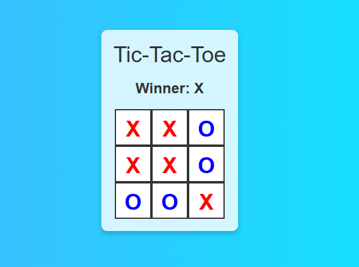

# 🎮 React Tic-Tac-Toe

A classic Tic-Tac-Toe game built with React. Play against a friend or the computer in this interactive game, showcasing the power of React components and hooks.

[Live Demo: Tic-Tac-Toe](https://neha645.github.io/Tic-Tac-Toe/)

## 📑 Table of Contents

- [Demo](#demo)
- [Features](#features)
- [Installation](#installation)
- [Usage](#usage)
- [Screenshots](#screenshots)
- [Technologies Used](#technologies-used)
- [Contributing](#contributing)
- [License](#license)


## ✨ Features

- 🆚 **Player vs Player** mode
<!-- - 🤖 **Player vs Computer** mode -->
- 🔄 **Responsive design** for mobile and desktop
- 🎨 Simple, clean UI with **smooth animations**
- 🛠 **Easy-to-reset** game state for replayability

---

## 🛠️ Installation

To run this project locally, follow these steps:

1. **Clone the repository**:
   ```bash
   git clone https://github.com/neha645/Tic-Tac-Toe.git
   ```

2. **Navigate to the project directory**:
   ```bash
   cd Tic-Tac-Toe
   ```

3. **Install dependencies**:
   ```bash
   npm install
   ```

4. **Start the development server**:
   ```bash
   npm run dev
   ```

The app will be running locally on `http://localhost:5173`.

---

## 🚀 Usage

- **Player vs Player**: Play with a friend by selecting the "2 Player" mode.
- **Player vs Computer**: Challenge the computer in "1 Player" mode.
- **Reset Game**: Click the "Reset" button anytime to start a new match.

---

## 🖼️ Screenshots

Here’s a glimpse of the **Tic-Tac-Toe** game:



---

## 🛠️ Technologies Used

- **React** - Frontend library for building the user interface
- **JavaScript (ES6+)** - For game logic and functionality
- **Tailwind CSS** - For styling and layout
- **gh-pages** - For deploying on GitHub Pages

---

## 🤝 Contributing

Contributions are welcome! Follow these steps to contribute:

1. **Fork the repository**.
2. **Create a new branch**:  
   ```bash
   git checkout -b feature/your-feature-name
   ```

3. **Make your changes** and commit them:
   ```bash
   git commit -m 'Added some feature'
   ```

4. **Push to the branch**:
   ```bash
   git push origin feature/your-feature-name
   ```

5. **Open a Pull Request** on GitHub.

---

## 📜 License

This project is licensed under the MIT License. See the [LICENSE](LICENSE) file for more details.

---

**Made with ❤️ by [Neha](https://github.com/neha645)**

---
